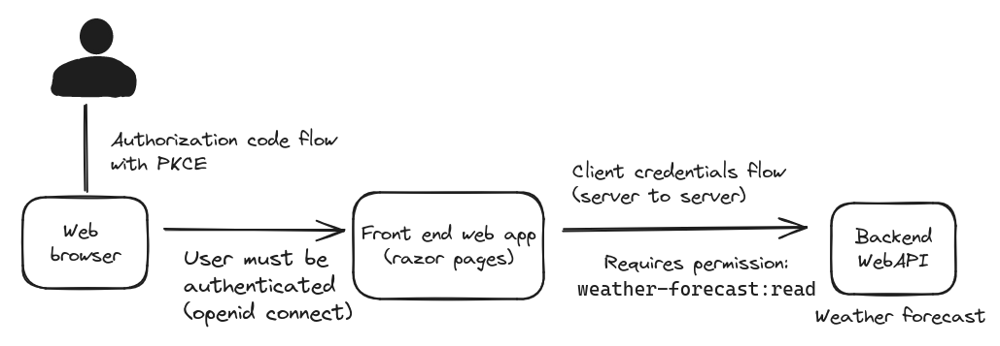

# Integration

To integrate Goiabada with your app, you'll need to explore your platform for an **OAuth2/OpenID Connect client library**. Many platforms provide such libraries for integration.

## Javascript-only

The github repository of Goiabada has a browser-based javascript [test client](https://github.com/leodip/goiabada/tree/main/test-integrations/js-only) that you can use to test Goiabada. It uses the [oauth4webapi](https://github.com/panva/oauth4webapi) library.

## dotnet C# example

We have a full working integration using dotnet C#.

The components of the solution are:

- A frontend web app application (ASP.NET razor pages) that requires the users to be authenticated in order to access an area of the site.
- A backend web api application (ASP.NET web api) responsible for serving weather forecasts. This API requires the permission `weather-forecast:read`.

The example uses OpenID Connect (authorization code flow with PKCE) to authenticate users on the frontend. Additionally, the client credentials flow is employed for the frontend server to obtain an access token for accessing the backend server.

Additionally, it implements secure logout (with encryption of the id token), and automatic refresh of the access tokens.

Please clone the [repo](https://github.com/leodip/goiabada) to have access to the code. It is located here - [https://github.com/leodip/goiabada/tree/main/test-integrations/dotnet6](https://github.com/leodip/goiabada/tree/main/test-integrations/dotnet6).

To run the example locally you need:

1. An instance of Goiabada running. The example is configured to use `https://localhost:8080` as Goiabada's base URL, but you can change this in `appsettings.json` if you want.
2. A client created in Goiabada called `dotnet6-integration-frontend`, with both Authorization code with PKCE and Client credentials flows enabled. 
3. You must also register these two redirect URIs within the `dotnet6-integration-frontend` client: `https://localhost:7096/signin-oidc` and `https://localhost:7096/LogoutFrontend`.
4. You need a resource with identifier `weather-forecast`. In this resource, you need a permission with identifier `read`.
5. You must assign the permission `weather-forecast:read` to client `dotnet6-integration-frontend`.
6. You must copy the client secret of `dotnet6-integration-frontend` to the configuration file `Goiabada.TestIntegration.Frontend/appsettings.json` (`OpenIDConnect:ClientSecret` and `WeatherForecastService:ClientSecret`)

Finally, you can make sure Goiabada is running, start up `Goiabada.TestIntegration.Backend` application (web api) and start up `Goiabada.TestIntegration.Frontend` application (razor pages). Then visit `https://localhost:7096` in your browser.